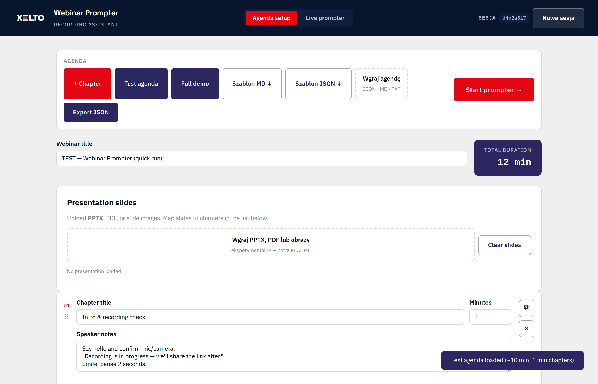
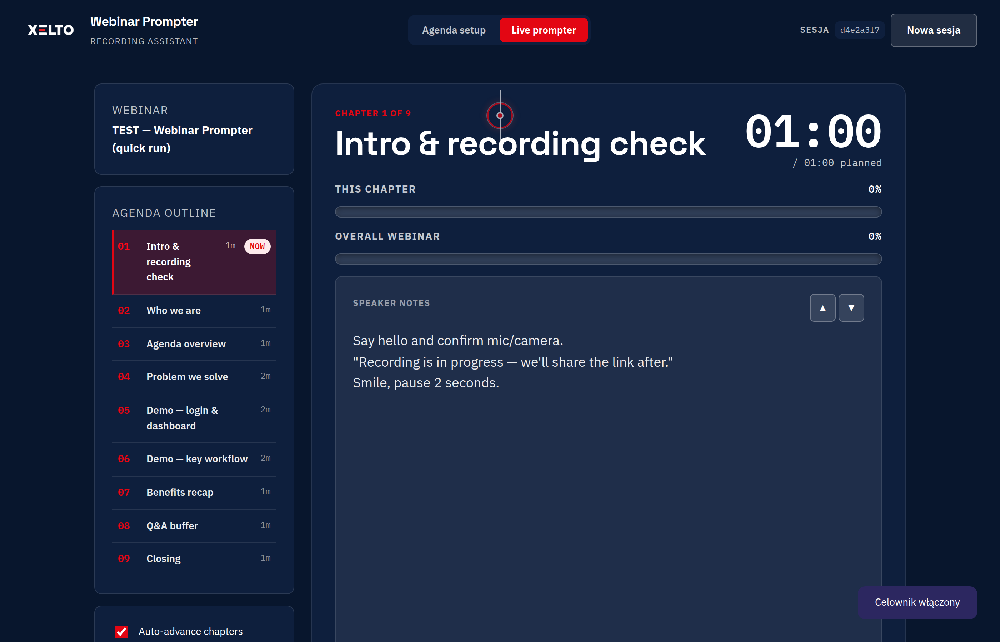
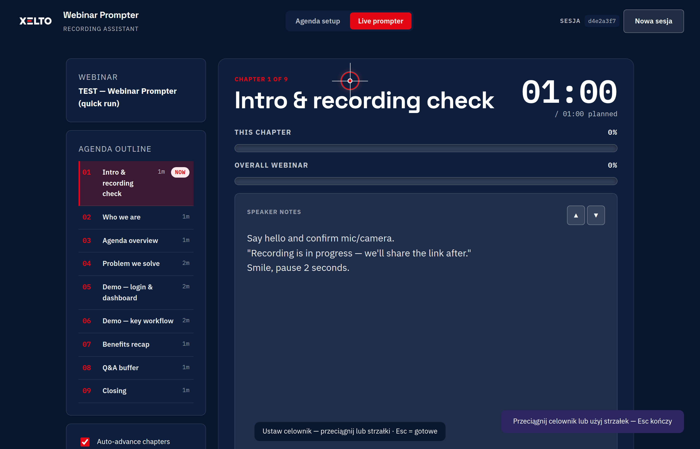

# Xelto Webinar Prompter

Przeglądarkowy **teleprompter do webinarów** — edytor agendy, notatki prelegenta, licznik na żywo i **celownik wzroku** pod nagrywanie.

**Demo (GitHub Pages):** [https://mikzielinski.github.io/webinarTool/](https://mikzielinski.github.io/webinarTool/)

> Aplikacja działa w całości w przeglądarce — bez serwera i bez wysyłania danych na zewnątrz.



---

## Polski

### Funkcje

- **Edytor agendy** — rozdziały z tytułem, czasem (minuty) i notatkami
- **Szablony MD / JSON** — pobierz, uzupełnij, wgraj jednym kliknięciem
- **Live prompter** — timer, postęp rozdziału i całego webinaru
- **Celownik wzroku** — drobna nakładka na ekranie; ustaw punkt, w który patrzysz (np. obiektyw kamery)
- **Auto-advance** — po czasie rozdziału odliczanie i przejście dalej
- **Tryb pełnoekranowy** — widok pod nagrywanie
- **Izolacja sesji** — każda karta przeglądarki ma własne dane (agenda, slajdy, ustawienia)

### Slajdy (eksperymentalne)

Można wgrywać **PPTX**, PDF lub obrazy i mapować slajdy na rozdziały.

**Uwaga:** obsługa slajdów (szczególnie PPTX) jest **eksperymentalna** — render może być wolny, podgląd nie zawsze 1:1. Do stabilnej pracy wystarczy agenda + notatki.

### Szybki start

1. Wejdź na [demo](https://mikzielinski.github.io/webinarTool/) lub uruchom lokalnie: `python3 scripts/dev-server.py` → [http://localhost:8080](http://localhost:8080)
2. Pobierz **Szablon MD ↓** lub **Szablon JSON ↓**, uzupełnij agendę, wgraj plik (**Wgraj agendę**)
3. Kliknij **Start prompter →** i uruchom licznik (**Start**)

### Celownik wzroku (gaze guide)

Podczas nagrywania webinaru kamera często nie jest w centrum ekranu. Celownik to **mała, półprzezroczysta nakładka** (krzyżyk w kółku), którą ustawiasz tam, gdzie chcesz patrzeć — np. na obiektyw kamery w podglądzie OBS.



**Jak ustawić:**

1. Przejdź do zakładki **Live prompter**
2. W panelu ustawień po lewej znajdź sekcję **Celownik wzroku**
3. Włącz **Pokaż celownik**
4. Kliknij **Ustaw pozycję** — przeciągnij celownik myszą lub przesuwaj **strzałkami** (Shift = szybciej)
5. **Esc** kończy tryb ustawiania
6. Dostosuj **rozmiar** i **przezroczystość** suwakami; **Domyślna** przywraca pozycję startową



Celownik jest widoczny na całym oknie (także w **Fullscreen**). Ustawienia zapisują się w przeglądarce w ramach bieżącej **sesji** (karty).

### Prywatność i wiele osób naraz

Brak backendu — dane tylko lokalnie. Każda **karta** ma ID **Sesja** w nagłówku; użytkownicy **nie widzą** nawzajem swoich agend. **Nowa sesja** zaczyna od pustego stanu w tej karcie.

### Format agendy (Markdown)

```markdown
# Mój webinar

## Wprowadzenie — 4 min
Powitanie uczestników...
```

Nagłówki `## Tytuł — X min`. Szczegóły w plikach `templates/agenda-template.md` i `.json`.

---

## English

### Features

- **Agenda editor** — chapters with title, duration, and speaker notes
- **MD / JSON templates** — download, fill in, upload
- **Live prompter** — countdown, chapter and overall progress
- **Gaze guide** — small on-screen crosshair overlay to mark where to look (e.g. camera lens)
- **Auto-advance** — countdown then next chapter when time is up
- **Fullscreen mode** — recording-friendly layout
- **Per-tab session isolation** — agenda, slides, and settings stay private per browser tab

### Slides (experimental)

**PPTX**, PDF, and images are supported with chapter mapping.

**Note:** slide rendering (especially PPTX) is **experimental** — slow renders and imperfect previews are possible. Agenda + notes alone are production-ready.

### Quick start

1. Open the [live demo](https://mikzielinski.github.io/webinarTool/) or run `python3 scripts/dev-server.py` locally
2. Download **Szablon MD ↓** or **Szablon JSON ↓**, edit, then **Wgraj agendę** (upload agenda)
3. Click **Start prompter →** and press **Start**

### Gaze guide

When recording, your camera is often off-center. The gaze guide is a **small semi-transparent crosshair** you place where you want to look — typically the camera lens in your OBS preview.

**How to set it up:**

1. Open the **Live prompter** tab
2. In the left settings panel, find **Celownik wzroku** (gaze guide)
3. Enable **Pokaż celownik** (show crosshair)
4. Click **Ustaw pozycję** (set position) — drag the marker or use **arrow keys** (Shift = larger steps)
5. Press **Esc** to exit adjust mode
6. Tune **size** and **opacity**; **Domyślna** resets to defaults

The overlay stays on top in **Fullscreen** mode. Settings are saved per browser tab **session**.

### Privacy

No server — all data stays in the browser. Each tab gets its own session ID; users on the same URL do not share agendas. **Nowa sesja** starts fresh in that tab.

### Agenda format (JSON)

```json
{
  "title": "My webinar",
  "chapters": [
    { "title": "Intro", "durationMinutes": 4, "notes": "Welcome..." }
  ]
}
```

See `templates/` for full examples.

---

## GitHub Pages

Deploy runs from `main` via `.github/workflows/pages.yml`. Enable **Settings → Pages → GitHub Actions** if needed.

## Project structure

```
index.html
css/
js/
  agenda.js
  gaze-guide.js      Gaze crosshair overlay
  workspace.js       Per-tab session isolation
  prompter.js
  slides.js
  pptx-loader.js
  app.js
templates/           Agenda templates (MD, JSON)
docs/screenshots/    README screenshots
brand/               Logo and design tokens
```

## License

Internal Xelto project — adjust license as needed for your organization.
